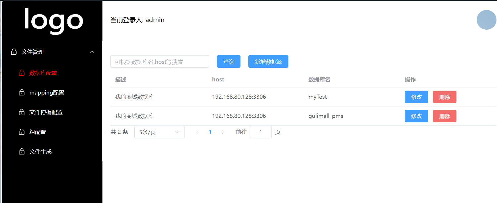

## **介绍**

这是一个通用的代码生成器
通过go template可以生成任何语言的代码

一切只需要你编写模板即可，自由度非常高
你可以根据自己的项目习惯，打造一套自己的代码生成体系

**中文文档**
```go
https://www.wolai.com/oG45Sf9qwNn5Y3AZebdRAu
```





## 模板语法
```go
{{/*把整个table对象赋值给$myTable，方便后面操作
这是tempate的基础，希望大家先去看学习gotempate语法*/}}
{{$myTable:=.}}

{{/*把表名转换为大驼峰命名，这是个sprig自带的方法*/}}
{{$tableCamel:= camelcase $myTable.TableName}}

{{/*表名转换到小驼峰，这是我们自定义的方法*/}}
{{$lowerMy:= lowerFirstCamel $myTable.TableName}}

package model

{{/*
go里导出的字段需要用函数转换到大驼峰命名，这里我们字段内置了大驼峰
这里之所以前面加了一个"-"号，是因为生成出来后行和行之间会有"几行空隙"，用-来消除
*/}}
type {{$myTable.TableNameWithBigCamel}} struct {
    {{- range $index, $field := $myTable.Fields}}
        {{- if eq $index 0}}
            {{$field.FieldNameWithBigCamel}} {{$field.FieldType}} `json:"{{$field.FieldNameWithSmallCamel}}" gorm:"primaryKey" comment:"{{$field.FieldComment}}"`
        {{- else}}
            {{$field.FieldNameWithBigCamel}} {{$field.FieldType}} `json:"{{$field.FieldNameWithSmallCamel}}" comment:"{{$field.FieldComment}}"`
        {{- end}}
    {{- end}}
}


type {{$tableCamel}}Request struct {
    {{/*遍历字段和字段类型，字段类型是经过mapping转换的，直接就是go的类型，并发数据库类型*/}}
    {{- range $index, $field := $myTable.Fields}}
        {{- if ne $index 0}}
            {{$field.FieldNameWithBigCamel}} {{$field.FieldType}} `json:"{{$field.FieldNameWithSmallCamel}}" binding:"required"`
        {{- end}}
    {{- end}}
}


type {{$myTable.TableNameWithBigCamel}}QuerySearch struct {
    Page int  `json:"page"`
    Size int  `json:"size"`
}

type {{$myTable.TableNameWithBigCamel}}ReponseAll struct {
    DataList []{{$myTable.TableNameWithBigCamel}} `json:"dataList"`
    Total    int64  `json:"total"`
}


func (receiver *{{$myTable.TableNameWithBigCamel}}Request) Validate()  (bool, error) {
    return true, nil
}
```


## 生成后的model
```go


package model


type User struct {
            Id int64 `json:"id" gorm:"primaryKey" comment:"id"`
            Name string `json:"name" comment:"用户名称"`
            Phone int64 `json:"phone" comment:"手机号"`
            Birth time.Time `json:"birth" comment:"生日"`
            CreatedAt time.Time `json:"createdAt" comment:"创建时间"`
            DeletedAt int `json:"deletedAt" comment:""`
}


type UserRequest struct {
            Name string `json:"name" binding:"required"`
            Phone int64 `json:"phone" binding:"required"`
            Birth time.Time `json:"birth" binding:"required"`
            CreatedAt time.Time `json:"createdAt" binding:"required"`
            DeletedAt int `json:"deletedAt" binding:"required"`
}


type UserQuerySearch struct {
    Page int  `json:"page"`
    Size int  `json:"size"`
}

type UserReponseAll struct {
    DataList []User `json:"dataList"`
    Total    int64  `json:"total"`
}


func (receiver *UserRequest) Validate()  (bool, error) {
    return true, nil
}

```


