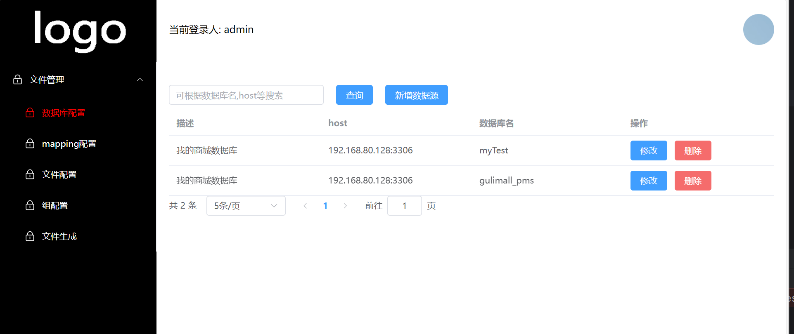
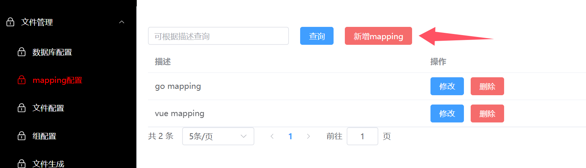
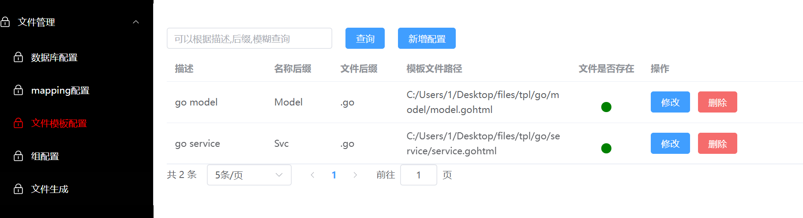
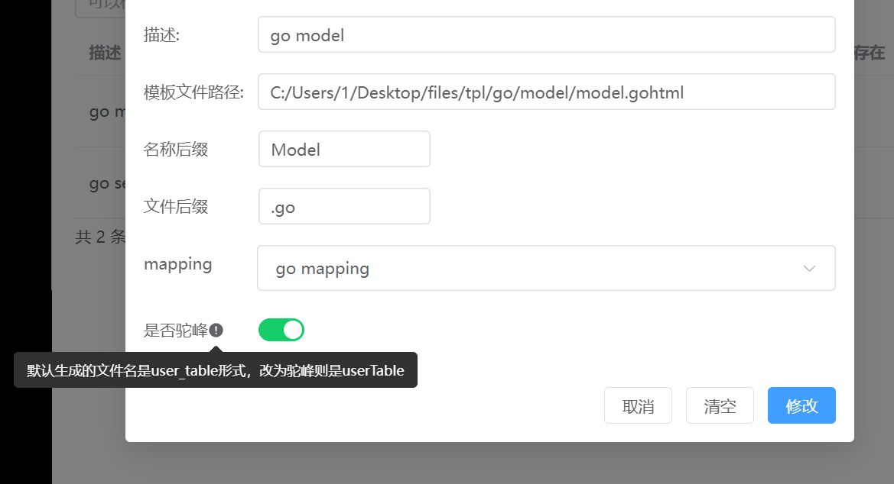
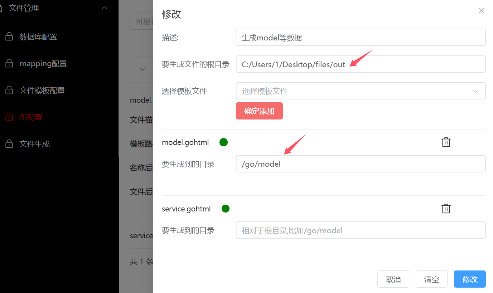
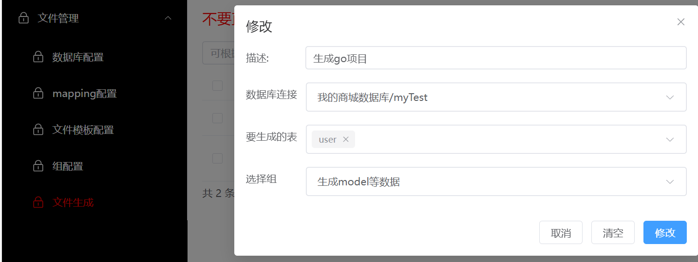
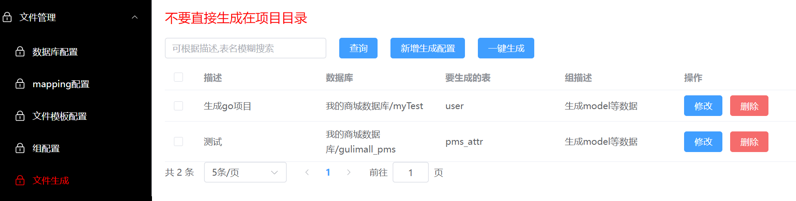
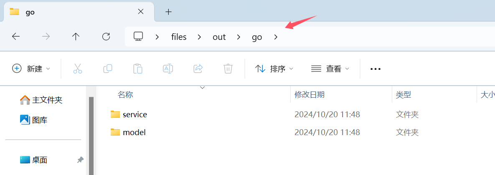

# 格外注意

如果生成文件之前，先删除之前的文件，直接覆盖的话会有点问题，会导致末尾乱码


# 部署

## 部署后端


**修改数据库连接**

修改为你自己的数据库，项目运行的时候会产生几张表，所以你最好提供一个专门的数据库用于存储本项目自动生成的几张表

```go
gorm:
  url: "root:root@tcp(192.168.80.128:3306)/myGenCode?charset=utf8&parseTime=True&loc=Local"

```


**运行项目**

```go
go run .\cmd\
```


## 部署前端


**运行前端项目**

```go
npm install

npm run dev
```


# 管理页面使用教程


## 数据源配置

**首先，你应该先配置一个数据源**

这个配置源是你要生成的库的数据源，在这里指定你要生成的数据库




## **mapping配置**

因为这是一个通用的代码生成器，所以需要你自己配置类型映射

比如数据库varchar类型对应go的类型是string




## 文件模板配置

你应该编写一个模板文件，模板的语法后面会讲解，采用go template的语法

然后指定这个模板所在的路径




名称后缀，假设我们要生成的表名是user表，那么最终生成的文件就是 userModel.go




## 组配置

一个组对应多个模板文件

可以设置model.gohtml这个模板文件在当前组的生成目录




可以指定{{tableSmallCamel}}代表表的名称

```go
//如果fileGroup.OutDir中含有{{tableSmallCamel}}，那么多生成一级目录
//也就是以表名生成一个文件夹，然后把生成的文件放到这个文件夹里
//采用替换的方式
//比如我们指定生成目录的时候指定要生成到/out/{{table}}目录
if strings.Contains(receiver.FinalOutDir, "{{table}}") {
    receiver.FinalOutDir = strings.ReplaceAll(receiver.FinalOutDir, "{{table}}", tbName)
} else if strings.Contains(receiver.FinalOutDir, "{{tableWithSmallCamel}}") {
    receiver.FinalOutDir = strings.ReplaceAll(receiver.FinalOutDir, "{{table}}", strutil.CamelCase(tbName))
} else if strings.Contains(receiver.FinalOutDir, "{{tableWithBigCamel}}") {
    receiver.FinalOutDir = strings.ReplaceAll(receiver.FinalOutDir, "{{table}}", strutil.UpperFirst(strutil.CamelCase(tbName)))
}

```


## 生成文件

我们需要指定组对应的表，表可以指定多个

这样一来，一个组下面会有多个模板文件，每一个模板文件都可以应用多个表




最后便可以生成文件了




最终生成的文件




# 模板语法

## go tempate

模板采用go tempate

```go
//一些go tempate语法的文档，大家自行去学习
https://cloud.tencent.com/developer/article/1683688


//sprig库，用于在模板页面进行一些字符串处理，比如转换到驼峰
https://masterminds.github.io/sprig/
```


## 可用的字段

你可以直接在页面上使用这些字段，具体可看生成model示例

```go
type Table struct {
	DB                       *gorm.DB
	TableName                string //表名
	IdName                   string //当前表的id的名称和类型，id必须在第1个字段
	IdType                   string
	IdNameWithSmallCamel     string  //小驼峰形式的id名称
	TableNameWithBigCamel    string  //大驼峰表名
	TableNameWithSmallCamel  string  //小驼峰表名
	TableComment             string  //表的注解
	DataBaseName             string  //表所在的数据库名称
	DataBaseNameWithNoPrefix string  //去除前缀的数据库名称
	Fields                   []field //表的字段
}

// Field代表数据库的字段名称和类型
type field struct {
  FieldName               string //原始字段名，从规则上来说应该设计为蛇形命名
  FieldNameWithBigCamel   string //大驼峰字段名,UserInfo
  FieldNameWithSmallCamel string //小驼峰字段名,userInfo
  FieldType               string //字段类型
  FieldComment            string //字段的注解
}

```


## 生成model示例


**模板文件**

这里涉及到go template语法，希望大家自己去了解

```go
{{$table:=.}}
package model

import (
  "gorm.io/gorm"
  "time"
)

type {{$table.TableNameWithBigCamel}} struct {
{{- range $index, $field := $table.Fields}}
  {{- if eq $index 0}}
    {{$field.FieldNameWithBigCamel}} {{$field.FieldType}} `json:"{{$field.FieldNameWithSmallCamel}}" gorm:"column:id;primaryKey" comment:"{{$field.FieldComment}}"`
  {{- else}}
    {{$field.FieldNameWithBigCamel}} {{$field.FieldType}} `json:"{{$field.FieldNameWithSmallCamel}}" gorm:"column:{{$field.FieldName}}" comment:"{{$field.FieldComment}}"`
  {{- end}}
{{- end}}
}

func (receiver *{{$table.TableNameWithBigCamel}}) TableName() string {
  return "{{$table.TableName}}"
}

type {{$table.TableNameWithBigCamel}}Request struct {
{{- range $index, $field := $table.Fields}}
  {{- if ne $index 0}}
    {{$field.FieldNameWithBigCamel}} {{$field.FieldType}} `json:"{{$field.FieldNameWithSmallCamel}}" binding:"required"`
  {{- end}}
{{- end}}
}

type {{$table.TableNameWithBigCamel}}Response struct {
{{- range $index, $field := $table.Fields}}
  {{- if ne $index 0}}
    {{$field.FieldNameWithBigCamel}} {{$field.FieldType}} `json:"{{$field.FieldNameWithSmallCamel}}" binding:"required"`
  {{- end}}
{{- end}}
}

type {{$table.TableNameWithBigCamel}}QuerySearch struct {
  Page     int    `json:"page"`
  Size     int    `json:"size"`
  QueryStr string `json:"queryStr"`
}

type {{$table.TableNameWithBigCamel}}ResponseAll struct {
  DataList []*{{$table.TableNameWithBigCamel}}Response `json:"dataList"`
  Total    int64           `json:"total"`
}

func (receiver *{{$table.TableNameWithBigCamel}}Request) Validate() (bool, error) {
  return true, nil
}


```


**最终生成的**

```go
package model

import (
  "gorm.io/gorm"
  "time"
)

type LayoutUserIdCard struct {
    Id int64 `json:"id" gorm:"column:id;primaryKey" comment:""`
    CardName string `json:"cardName" gorm:"column:card_name" comment:""`
    UserId int64 `json:"userId" gorm:"column:user_id" comment:""`
    CreatedAt time.Time `json:"createdAt" gorm:"column:created_at" comment:""`
    UpdatedAt time.Time `json:"updatedAt" gorm:"column:updated_at" comment:""`

    //生成出来不是万能的，比如这里你就需要改为gorm.DeleteAt
    //或者在customFunc里添加函数处理
    DeletedAt time.Time `json:"deletedAt" gorm:"column:deleted_at" comment:""`
}

func (receiver *LayoutUserIdCard) TableName() string {
  return "layout_user_id_card"
}

type LayoutUserIdCardRequest struct {
    CardName string `json:"cardName" binding:"required"`
    UserId int64 `json:"userId" binding:"required"`
    CreatedAt time.Time `json:"createdAt" binding:"required"`
    UpdatedAt time.Time `json:"updatedAt" binding:"required"`
    DeletedAt time.Time `json:"deletedAt" binding:"required"`
}

type LayoutUserIdCardResponse struct {
    CardName string `json:"cardName" binding:"required"`
    UserId int64 `json:"userId" binding:"required"`
    CreatedAt time.Time `json:"createdAt" binding:"required"`
    UpdatedAt time.Time `json:"updatedAt" binding:"required"`
    DeletedAt time.Time `json:"deletedAt" binding:"required"`
}

type LayoutUserIdCardQuerySearch struct {
  Page     int    `json:"page"`
  Size     int    `json:"size"`
  QueryStr string `json:"queryStr"`
}

type LayoutUserIdCardResponseAll struct {
  DataList []*LayoutUserIdCardResponse `json:"dataList"`
  Total    int64           `json:"total"`
}

func (receiver *LayoutUserIdCardRequest) Validate() (bool, error) {
  return true, nil
}
) Validate() (bool, error) {
  return true, nil
}


```


## **自定义函数**

你可以在CustomFunc 方法里自定义自己的方法

```go
// CustomFunc 自定义函数
var (
  CustomFunc = template.FuncMap{
    //转换到驼峰后，首字母小写
    "lowerFirstCamel": func(str string) string {
      camelStr := strutil.CamelCase(str)
      first := camelStr[:1]
      remain := camelStr[1:]
      first = strings.ToLower(first)
      return first + remain
    },
    "isGormDeleteAt": func(str string) bool {
      //如果是deleteAt字段，那么类型变为gorm.DeletedAt
      if strings.Contains(str, "DeletedAt") ||
        strings.Contains(str, "deleted_at") ||
        strings.Contains(str, "deleteAt") {
        return true
      }
      return false
    },
  }
)
```


**应用isGormDeleteAt**

```go
type {{$table.TableNameWithBigCamel}} struct {
{{- range $index, $field := $table.Fields}}
  {{- if eq $index 0}}
    {{$field.FieldNameWithBigCamel}} {{$field.FieldType}} `json:"{{$field.FieldNameWithSmallCamel}}" gorm:"column:id;primaryKey" comment:"{{$field.FieldComment}}"`
  {{- else if eq (isGormDeleteAt $field.FieldName) true}}
     //这里如果返回true，那么类型直接就是gorm.DeletedAt
    {{$field.FieldNameWithBigCamel}} gorm.DeletedAt `json:"{{$field.FieldNameWithSmallCamel}}" gorm:"column:{{$field.FieldName}}" comment:"{{$field.FieldComment}}"`
  {{else}}
    {{$field.FieldNameWithBigCamel}} {{$field.FieldType}} `json:"{{$field.FieldNameWithSmallCamel}}" gorm:"column:{{$field.FieldName}}" comment:"{{$field.FieldComment}}"`
  {{- end}}
{{- end}}
}

```
