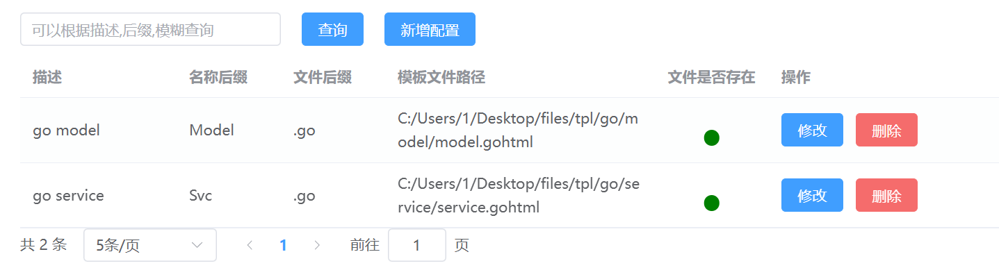

# 前台交互


## 数据库配置


**数据库配置的修改，添加**


## mapping配置


**mapping的添加，修改**


## 文件配置




**文件的新增，修改**

需要注意，我们的路径需要用/，但是从windows直接复制的是\，所以我们在后端要改一下


## 组配置

组配置可以看到组里的模板文件，以及可以直接在这里修改


**添加，修改组配置**

这里的生成目录和model模板是通过一个中间件表关联，因为一个model可以在不同的组里指定不同的生成目录


## 生成文件配置

在这里我们可以指定某一个组对应多少表

并且选中多个组后，可以一键生成


**生成文件的添加，修改**


# mapping集合

### **go的mapping配置**

```go
{
  "bigint": "int64",
  "varchar": "string",
  "longtext": "string",
  "char": "string",
  "int": "int",
  "datetime": "time.Time",
  "date": "time.Time",
  "tinyint": "byte",
  "float": "float64"
}
```

